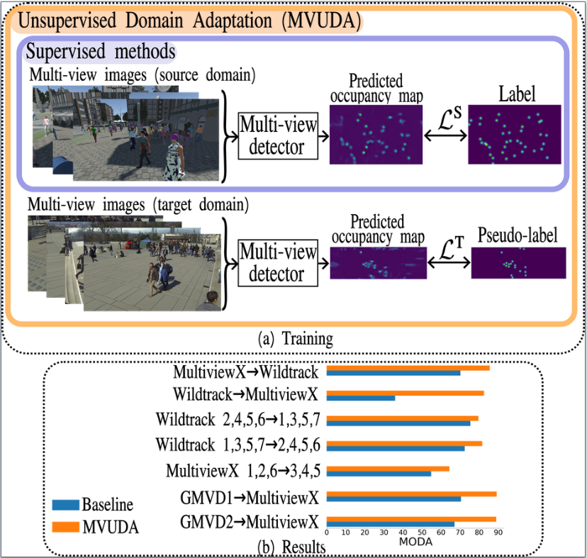

# MVUDA: Unsupervised Domain Adaptation for Multi-view Pedestrian Detection [[arXiv](https://arxiv.org/abs/2412.04117)]
```
@misc{brorsson2024mvudaunsuperviseddomainadaptation,
      title={MVUDA: Unsupervised Domain Adaptation for Multi-view Pedestrian Detection}, 
      author={Erik Brorsson and Lennart Svensson and Kristofer Bengtsson and Knut Åkesson},
      year={2024},
      eprint={2412.04117},
      archivePrefix={arXiv},
      primaryClass={cs.CV},
      url={https://arxiv.org/abs/2412.04117}, 
}
```

We address multi-view pedestrian detection in a setting where labeled data is collected using a multi-camera setup different from the one used for testing. While recent multi-view pedestrian detectors perform well on the camera rig used for training, their performance declines when applied to a different setup.
To facilitate seamless deployment across varied camera rigs, we propose an unsupervised domain adaptation (UDA) method that adapts the model to new rigs without requiring additional labeled data. Specifically, we leverage the mean teacher self-training framework with a novel pseudo-labeling technique tailored to multi-view pedestrian detection. This method achieves state-of-the-art performance on multiple benchmarks, including MultiviewX$\rightarrow$Wildtrack. 
Unlike previous methods, our approach eliminates the need for external labeled monocular datasets, thereby reducing reliance on labeled data. Extensive evaluations demonstrate the effectiveness of our method and validate key design choices. By enabling robust adaptation across camera setups, our work enhances the practicality of multi-view pedestrian detectors and establishes a strong UDA baseline for future research.





## MVUDA Code

### Dependencies
We conduct all our experiments in a docker environment (Docker version 24.0.2).  
Please build from the provided Dockerfile.

### Data Preparation
We use [Wildtrack](https://www.epfl.ch/labs/cvlab/data/data-wildtrack/), [MultiviewX](https://github.com/hou-yz/MVDet?tab=readme-ov-file#multiviewx-dataset) and [GMVD](https://github.com/jeetv/GMVD_dataset) in this project. Follow the instructions in the respective links to download the data. 
 
In our code, we further assume the existence of a config.json file for Wildtrack and MultiviewX, since we use the dataloader of GMVD.
We also use a csv file for the case of GMVD describing which subsets of the GMVD dataset that is used.
Copy (and rename) our config files from [here](configs/datasets) to the respective data folder.
The data folder should look like this:
```
Data
├── Wildtrack/ 
    └── ...
    └── config.json
└── MultiviewX/
    └── ...
    └── config.json
└── GMVD/
    └── ...
    └── scene1_config1.csv
    └── scene1_config2.csv
```

### Training
In order to train the model, run the below command with the desired config (examples are provided [here](configs/experiments)):

python main.py --config "YOUR CONFIG"


For example, configs/experiments/gmvd1_mvx_uda.json should yield similar results as presented below and reported in the paper on GMVD1->MultiviewX (89.0 MODA).

### Results (on GMVD1->MultiviewX)

MVUDA results:

  
 
 
 Comparison with the baseline:

   

### Checkpoints
Checkpoints and results on the other benchmarks are available [here](https://drive.google.com/drive/folders/1P0dgInoPV5ooDzvI4xBHOMUvTe95fgKe?usp=sharing)

## Acknowledgement

We thank the authors of the following repositories for making their code publicly available.

- [MVDet](https://github.com/hou-yz/MVDet)
- [GMVD](https://github.com/jeetv/GMVD)
- [3DROM](https://github.com/xjtlu-cvlab/3DROM)
- [MVAug](https://github.com/cvlab-epfl/MVAug)
